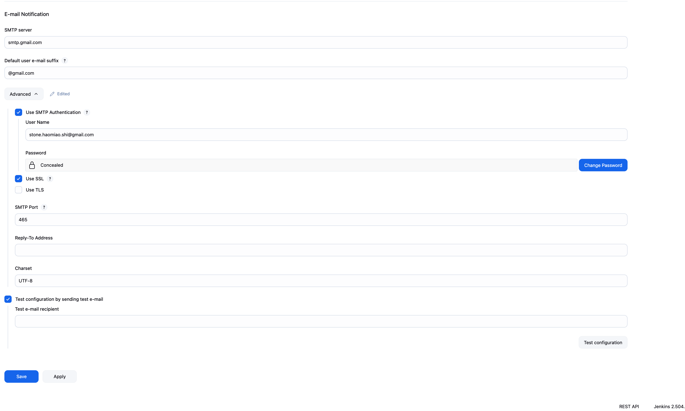

<div align="center">
  

  <br>
  <a href="http://netflix-clone-with-tmdb-using-react-mui.vercel.app/">
    
  </a>
</div>

<br />

<div align="center">
  
  <p align="center">Home Page</p>
</div>

# Deploy Netflix Clone on Cloud using Jenkins - DevSecOps Project!

### **Phase 1: Initial Setup and Deployment**

**Step 1: Launch EC2 (Ubuntu 22.04):**

- Provision an EC2 instance on AWS with Ubuntu 22.04.
- Connect to the instance using SSH.

**Step 2: Clone the Code:**

- Update all the packages and then clone the code.
- Clone your application's code repository onto the EC2 instance:
    
    ```bash
    git clone https://github.com/stone-coding/DevSecOps-Project.git
    ```
    

**Step 3: Install Docker and Run the App Using a Container:**

- Set up Docker on the EC2 instance:
    
    ```bash
    
    sudo apt-get update
    sudo apt-get install docker.io -y
    sudo usermod -aG docker $USER  # Replace with your system's username, e.g., 'ubuntu'
    newgrp docker
    sudo chmod 777 /var/run/docker.sock
    ```
    
- Build and run your application using Docker containers:
    
    ```bash
    docker build -t netflix .
    docker run -d --name netflix -p 8081:80 netflix:latest
    
    #to delete
    docker stop <containerid>
    docker rmi -f netflix
    ```

It will show an error cause you need API key

**Step 4: Get the API Key:**

- Open a web browser and navigate to TMDB (The Movie Database) website.
- Click on "Login" and create an account.
- Once logged in, go to your profile and select "Settings."
- Click on "API" from the left-side panel.
- Create a new API key by clicking "Create" and accepting the terms and conditions.
- Provide the required basic details and click "Submit."
- You will receive your TMDB API key.

Now recreate the Docker image with your api key:
```
docker build --build-arg TMDB_V3_API_KEY=<your-api-key> -t netflix .
```

**Phase 2: Security**

1. **Install SonarQube and Trivy:**
    - Install SonarQube and Trivy on the EC2 instance to scan for vulnerabilities.
        
        sonarqube
        ```
        docker run -d --name sonar -p 9000:9000 sonarqube:lts-community
        ```
        
        
        To access: 
        
        publicIP:9000 (by default username & password is admin)
        
        To install Trivy:
        ```
        sudo apt-get install wget apt-transport-https gnupg lsb-release
        wget -qO - https://aquasecurity.github.io/trivy-repo/deb/public.key | sudo apt-key add -
        echo deb https://aquasecurity.github.io/trivy-repo/deb $(lsb_release -sc) main | sudo tee -a /etc/apt/sources.list.d/trivy.list
        sudo apt-get update
        sudo apt-get install trivy        
        ```
        
        to scan image using trivy
        ```
        trivy image <imageid>
        ```
        
        
2. **Integrate SonarQube and Configure:**
    - Integrate SonarQube with your CI/CD pipeline.
    - Configure SonarQube to analyze code for quality and security issues.

**Phase 3: CI/CD Setup**

1. **Install Jenkins for Automation:**
    - Install Jenkins on the EC2 instance to automate deployment:
    Install Java
    
    ```bash
    sudo apt update
    sudo apt install fontconfig openjdk-17-jre
    java -version
    openjdk version "17.0.8" 2023-07-18
    OpenJDK Runtime Environment (build 17.0.8+7-Debian-1deb12u1)
    OpenJDK 64-Bit Server VM (build 17.0.8+7-Debian-1deb12u1, mixed mode, sharing)
    
    #jenkins
    sudo wget -O /usr/share/keyrings/jenkins-keyring.asc \
    https://pkg.jenkins.io/debian-stable/jenkins.io-2023.key
    echo deb [signed-by=/usr/share/keyrings/jenkins-keyring.asc] \
    https://pkg.jenkins.io/debian-stable binary/ | sudo tee \
    /etc/apt/sources.list.d/jenkins.list > /dev/null
    sudo apt-get update
    sudo apt-get install jenkins
    sudo systemctl start jenkins
    sudo systemctl enable jenkins
    ```
    
    - Access Jenkins in a web browser using the public IP of your EC2 instance.
        
        publicIp:8080
        
2. **Install Necessary Plugins in Jenkins:**

Goto Manage Jenkins →Plugins → Available Plugins →

Install below plugins

1 Eclipse Temurin Installer (Install without restart)

2 SonarQube Scanner (Install without restart)

3 NodeJs Plugin (Install Without restart)

4 Email Extension Plugin

### **Configure Java and Nodejs in Global Tool Configuration**

Goto Manage Jenkins → Tools → Install JDK(17) and NodeJs(16)→ Click on Apply and Save


### SonarQube

Create the token

Goto Jenkins Dashboard → Manage Jenkins → Credentials → Add Secret Text. It should look like this

After adding sonar token

Click on Apply and Save

**The Configure System option** is used in Jenkins to configure different server

**Global Tool Configuration** is used to configure different tools that we install using Plugins

We will install a sonar scanner in the tools.

Create a Jenkins webhook

1. **Configure CI/CD Pipeline in Jenkins:**
- Create a CI/CD pipeline in Jenkins to automate your application deployment.

```groovy
pipeline {
    agent any
    tools {
        jdk 'jdk17'
        nodejs 'node16'
    }
    environment {
        SCANNER_HOME = tool 'sonar-scanner'
    }
    stages {
        stage('clean workspace') {
            steps {
                cleanWs()
            }
        }
        stage('Checkout from Git') {
            steps {
                git branch: 'main', url: 'https://github.com/stone-coding/DevSecOps-Project.git'
            }
        }
        stage("Sonarqube Analysis") {
            steps {
                withSonarQubeEnv('sonar-server') {
                    sh '''$SCANNER_HOME/bin/sonar-scanner -Dsonar.projectName=Netflix \
                    -Dsonar.projectKey=Netflix'''
                }
            }
        }
        stage("quality gate") {
            steps {
                script {
                    waitForQualityGate abortPipeline: false, credentialsId: 'Sonar-token'
                }
            }
        }
        stage('Install Dependencies') {
            steps {
                sh "npm install"
            }
        }
    }
}
```

Certainly, here are the instructions without step numbers:

**Install Dependency-Check and Docker Tools in Jenkins**

**Install Dependency-Check Plugin:**

- Go to "Dashboard" in your Jenkins web interface.
- Navigate to "Manage Jenkins" → "Manage Plugins."
- Click on the "Available" tab and search for "OWASP Dependency-Check."
- Check the checkbox for "OWASP Dependency-Check" and click on the "Install without restart" button.

**Configure Dependency-Check Tool:**

- After installing the Dependency-Check plugin, you need to configure the tool.
- Go to "Dashboard" → "Manage Jenkins" → "Global Tool Configuration."
- Find the section for "OWASP Dependency-Check."
- Add the tool's name, e.g., "DP-Check."
- Save your settings.

**Install Docker Tools and Docker Plugins:**

- Go to "Dashboard" in your Jenkins web interface.
- Navigate to "Manage Jenkins" → "Manage Plugins."
- Click on the "Available" tab and search for "Docker."
- Check the following Docker-related plugins:
  - Docker
  - Docker Commons
  - Docker Pipeline
  - Docker API
  - docker-build-step
- Click on the "Install without restart" button to install these plugins.

**Add DockerHub Credentials:**

- To securely handle DockerHub credentials in your Jenkins pipeline, follow these steps:
  - Go to "Dashboard" → "Manage Jenkins" → "Manage Credentials."
  - Click on "System" and then "Global credentials (unrestricted)."
  - Click on "Add Credentials" on the left side.
  - Choose "Secret text" as the kind of credentials.
  - Enter your DockerHub credentials (Username and Password) and give the credentials an ID (e.g., "docker").
  - Click "OK" to save your DockerHub credentials.

Now, you have installed the Dependency-Check plugin, configured the tool, and added Docker-related plugins along with your DockerHub credentials in Jenkins. You can now proceed with configuring your Jenkins pipeline to include these tools and credentials in your CI/CD process.

```groovy

pipeline{
    agent any
    tools{
        jdk 'jdk17'
        nodejs 'node16'
    }
    environment {
        SCANNER_HOME=tool 'sonar-scanner'
    }
    stages {
        stage('clean workspace'){
            steps{
                cleanWs()
            }
        }
        stage('Checkout from Git'){
            steps{
                git branch: 'main', url: 'https://github.com/stone-coding/DevSecOps-Project.git'
            }
        }
        stage("Sonarqube Analysis "){
            steps{
                withSonarQubeEnv('sonar-server') {
                    sh ''' $SCANNER_HOME/bin/sonar-scanner -Dsonar.projectName=Netflix \
                    -Dsonar.projectKey=Netflix '''
                }
            }
        }
        stage("quality gate"){
           steps {
                script {
                    waitForQualityGate abortPipeline: false, credentialsId: 'Sonar-token' 
                }
            } 
        }
        stage('Install Dependencies') {
            steps {
                sh "npm install"
            }
        }
        stage('OWASP FS SCAN') {
            steps {
                dependencyCheck additionalArguments: '--scan ./ --disableYarnAudit --disableNodeAudit', odcInstallation: 'DP-Check'
                dependencyCheckPublisher pattern: '**/dependency-check-report.xml'
            }
        }
        stage('TRIVY FS SCAN') {
            steps {
                sh "trivy fs . > trivyfs.txt"
            }
        }
        stage("Docker Build & Push"){
            steps{
                script{
                   withDockerRegistry(credentialsId: 'docker', toolName: 'docker'){   
                       sh "docker build --build-arg TMDB_V3_API_KEY=3cb7b808a55cac1a0cfe4891859a3577 -t netflix ."
                       sh "docker tag netflix stone037/netflix:latest"
                       sh "docker push stone037/netflix:latest"
                    }
                }
            }
        }
        stage("TRIVY"){
            steps{
                sh "trivy image stone037/netflix:latest > trivyimage.txt" 
            }
        }
        stage('Deploy to container'){
            steps{
                sh 'docker run -d -p 8081:80 stone037/netflix:latest'
            }
        }
    }
}


If you get docker login failed errorr

sudo su
sudo usermod -aG docker jenkins
sudo systemctl restart jenkins


```

**Phase 4: Monitoring**

1. **Install Prometheus and Grafana:**

   Set up Prometheus and Grafana to monitor your application.

   **Installing Prometheus:**

   First, create a dedicated Linux user for Prometheus and download Prometheus:

   ```bash
   sudo useradd --system --no-create-home --shell /bin/false prometheus
   wget https://github.com/prometheus/prometheus/releases/download/v2.47.1/prometheus-2.47.1.linux-amd64.tar.gz
   ```

   Extract Prometheus files, move them, and create directories:

   ```bash
   tar -xvf prometheus-2.47.1.linux-amd64.tar.gz
   cd prometheus-2.47.1.linux-amd64/
   sudo mkdir -p /data /etc/prometheus
   sudo mv prometheus promtool /usr/local/bin/
   sudo mv consoles/ console_libraries/ /etc/prometheus/
   sudo mv prometheus.yml /etc/prometheus/prometheus.yml
   ```

   Set ownership for directories:

   ```bash
   sudo chown -R prometheus:prometheus /etc/prometheus/ /data/
   ```

   Create a systemd unit configuration file for Prometheus:

   ```bash
   sudo nano /etc/systemd/system/prometheus.service
   ```

   Add the following content to the `prometheus.service` file:

   ```plaintext
   [Unit]
   Description=Prometheus
   Wants=network-online.target
   After=network-online.target

   StartLimitIntervalSec=500
   StartLimitBurst=5

   [Service]
   User=prometheus
   Group=prometheus
   Type=simple
   Restart=on-failure
   RestartSec=5s
   ExecStart=/usr/local/bin/prometheus \
     --config.file=/etc/prometheus/prometheus.yml \
     --storage.tsdb.path=/data \
     --web.console.templates=/etc/prometheus/consoles \
     --web.console.libraries=/etc/prometheus/console_libraries \
     --web.listen-address=0.0.0.0:9090 \
     --web.enable-lifecycle

   [Install]
   WantedBy=multi-user.target
   ```

   Here's a brief explanation of the key parts in this `prometheus.service` file:

   - `User` and `Group` specify the Linux user and group under which Prometheus will run.

   - `ExecStart` is where you specify the Prometheus binary path, the location of the configuration file (`prometheus.yml`), the storage directory, and other settings.

   - `web.listen-address` configures Prometheus to listen on all network interfaces on port 9090.

   - `web.enable-lifecycle` allows for management of Prometheus through API calls.

   Enable and start Prometheus:

   ```bash
   sudo systemctl enable prometheus
   sudo systemctl start prometheus
   ```

   Verify Prometheus's status:

   ```bash
   sudo systemctl status prometheus
   ```

   You can access Prometheus in a web browser using your server's IP and port 9090:

   `http://<your-server-ip>:9090`

   **Installing Node Exporter:**

   Create a system user for Node Exporter and download Node Exporter:

   ```bash
   sudo useradd --system --no-create-home --shell /bin/false node_exporter
   wget https://github.com/prometheus/node_exporter/releases/download/v1.6.1/node_exporter-1.6.1.linux-amd64.tar.gz
   ```

   Extract Node Exporter files, move the binary, and clean up:

   ```bash
   tar -xvf node_exporter-1.6.1.linux-amd64.tar.gz
   sudo mv node_exporter-1.6.1.linux-amd64/node_exporter /usr/local/bin/
   rm -rf node_exporter*
   ```

   Create a systemd unit configuration file for Node Exporter:

   ```bash
   sudo nano /etc/systemd/system/node_exporter.service
   ```

   Add the following content to the `node_exporter.service` file:

   ```plaintext
   [Unit]
   Description=Node Exporter
   Wants=network-online.target
   After=network-online.target

   StartLimitIntervalSec=500
   StartLimitBurst=5

   [Service]
   User=node_exporter
   Group=node_exporter
   Type=simple
   Restart=on-failure
   RestartSec=5s
   ExecStart=/usr/local/bin/node_exporter --collector.logind

   [Install]
   WantedBy=multi-user.target
   ```

   Replace `--collector.logind` with any additional flags as needed.

   Enable and start Node Exporter:

   ```bash
   sudo systemctl enable node_exporter
   sudo systemctl start node_exporter
   ```

   Verify the Node Exporter's status:

   ```bash
   sudo systemctl status node_exporter
   ```

   You can access Node Exporter metrics in Prometheus.

2. **Configure Prometheus Plugin Integration:**

   Integrate Jenkins with Prometheus to monitor the CI/CD pipeline.

   **Prometheus Configuration:**

   To configure Prometheus to scrape metrics from Node Exporter and Jenkins, you need to modify the `prometheus.yml` file. Here is an example `prometheus.yml` configuration for your setup:

   ```yaml
   global:
     scrape_interval: 15s

   scrape_configs:
     - job_name: 'node_exporter'
       static_configs:
         - targets: ['localhost:9100']

     - job_name: 'jenkins'
       metrics_path: '/prometheus'
       static_configs:
         - targets: ['<your-jenkins-ip>:<your-jenkins-port>']
   ```

   Make sure to replace `<your-jenkins-ip>` and `<your-jenkins-port>` with the appropriate values for your Jenkins setup.

   Check the validity of the configuration file:

   ```bash
   promtool check config /etc/prometheus/prometheus.yml
   ```

   Reload the Prometheus configuration without restarting:

   ```bash
   curl -X POST http://localhost:9090/-/reload
   ```

   You can access Prometheus targets at:

   `http://<your-prometheus-ip>:9090/targets`


####Grafana

**Install Grafana on Ubuntu 22.04 and Set it up to Work with Prometheus**

**Step 1: Install Dependencies:**

First, ensure that all necessary dependencies are installed:

```bash
sudo apt-get update
sudo apt-get install -y apt-transport-https software-properties-common
```

**Step 2: Add the GPG Key:**

Add the GPG key for Grafana:

```bash
wget -q -O - https://packages.grafana.com/gpg.key | sudo apt-key add -
```

**Step 3: Add Grafana Repository:**

Add the repository for Grafana stable releases:

```bash
echo "deb https://packages.grafana.com/oss/deb stable main" | sudo tee -a /etc/apt/sources.list.d/grafana.list
```

**Step 4: Update and Install Grafana:**

Update the package list and install Grafana:

```bash
sudo apt-get update
sudo apt-get -y install grafana
```

**Step 5: Enable and Start Grafana Service:**

To automatically start Grafana after a reboot, enable the service:

```bash
sudo systemctl enable grafana-server
```

Then, start Grafana:

```bash
sudo systemctl start grafana-server
```

**Step 6: Check Grafana Status:**

Verify the status of the Grafana service to ensure it's running correctly:

```bash
sudo systemctl status grafana-server
```

**Step 7: Access Grafana Web Interface:**

Open a web browser and navigate to Grafana using your server's IP address. The default port for Grafana is 3000. For example:

`http://<your-server-ip>:3000`

You'll be prompted to log in to Grafana. The default username is "admin," and the default password is also "admin."

**Step 8: Change the Default Password:**

When you log in for the first time, Grafana will prompt you to change the default password for security reasons. Follow the prompts to set a new password.

**Step 9: Add Prometheus Data Source:**

To visualize metrics, you need to add a data source. Follow these steps:

- Click on the gear icon (⚙️) in the left sidebar to open the "Configuration" menu.

- Select "Data Sources."

- Click on the "Add data source" button.

- Choose "Prometheus" as the data source type.

- In the "HTTP" section:
  - Set the "URL" to `http://localhost:9090` (assuming Prometheus is running on the same server).
  - Click the "Save & Test" button to ensure the data source is working.

**Step 10: Import a Dashboard:**

To make it easier to view metrics, you can import a pre-configured dashboard. Follow these steps:

- Click on the "+" (plus) icon in the left sidebar to open the "Create" menu.

- Select "Dashboard."

- Click on the "Import" dashboard option.

- Enter the dashboard code you want to import (e.g., code 1860).

- Click the "Load" button.

- Select the data source you added (Prometheus) from the dropdown.

- Click on the "Import" button.

You should now have a Grafana dashboard set up to visualize metrics from Prometheus.

Grafana is a powerful tool for creating visualizations and dashboards, and you can further customize it to suit your specific monitoring needs.

That's it! You've successfully installed and set up Grafana to work with Prometheus for monitoring and visualization.

2. **Configure Prometheus Plugin Integration:**
    - Integrate Jenkins with Prometheus to monitor the CI/CD pipeline.


**Phase 5: Notification**

1. **Implement Notification Services:**
    - Set up email notifications in Jenkins or other notification mechanisms.

# Phase 6: Kubernetes

## Create Kubernetes Cluster with Nodegroups

In this phase, you'll set up a Kubernetes cluster with node groups. This will provide a scalable environment to deploy and manage your applications.

## Monitor Kubernetes with Prometheus

Prometheus is a powerful monitoring and alerting toolkit, and you'll use it to monitor your Kubernetes cluster. Additionally, you'll install the node exporter using Helm to collect metrics from your cluster nodes.

### Install Node Exporter using Helm

To begin monitoring your Kubernetes cluster, you'll install the Prometheus Node Exporter. This component allows you to collect system-level metrics from your cluster nodes. Here are the steps to install the Node Exporter using Helm:

1. Add the Prometheus Community Helm repository:

    ```bash
    helm repo add prometheus-community https://prometheus-community.github.io/helm-charts
    ```

2. Create a Kubernetes namespace for the Node Exporter:

    ```bash
    kubectl create namespace prometheus-node-exporter
    ```

3. Install the Node Exporter using Helm:

    ```bash
    helm install prometheus-node-exporter prometheus-community/prometheus-node-exporter --namespace prometheus-node-exporter
    ```

Add a Job to Scrape Metrics on nodeip:9001/metrics in prometheus.yml:

Update your Prometheus configuration (prometheus.yml) to add a new job for scraping metrics from nodeip:9001/metrics. You can do this by adding the following configuration to your prometheus.yml file:


```
  - job_name: 'Netflix'
    metrics_path: '/metrics'
    static_configs:
      - targets: ['node1Ip:9100']
```

Replace 'your-job-name' with a descriptive name for your job. The static_configs section specifies the targets to scrape metrics from, and in this case, it's set to nodeip:9001.

Don't forget to reload or restart Prometheus to apply these changes to your configuration.

To deploy an application with ArgoCD, you can follow these steps, which I'll outline in Markdown format:

### Deploy Application with ArgoCD

1. **Install ArgoCD:**

   You can install ArgoCD on your Kubernetes cluster by following the instructions provided in the [EKS Workshop](https://archive.eksworkshop.com/intermediate/290_argocd/install/) documentation.

2. **Set Your GitHub Repository as a Source:**

   After installing ArgoCD, you need to set up your GitHub repository as a source for your application deployment. This typically involves configuring the connection to your repository and defining the source for your ArgoCD application. The specific steps will depend on your setup and requirements.

3. **Create an ArgoCD Application:**
   - `name`: Set the name for your application.
   - `destination`: Define the destination where your application should be deployed.
   - `project`: Specify the project the application belongs to.
   - `source`: Set the source of your application, including the GitHub repository URL, revision, and the path to the application within the repository.
   - `syncPolicy`: Configure the sync policy, including automatic syncing, pruning, and self-healing.

4. **Access your Application**
   - To Access the app make sure port 30007 is open in your security group and then open a new tab paste your NodeIP:30007, your app should be running.


**Phase 7: Cost Estimation**

### **EC2 Instances**

4 running instances:

1. **t2.large**
2. **t2.medium**
3. **t3.medium** (x2)

**On-Demand Pricing (us-west-2 Oregon)**:

| Instance Type | vCPU | RAM | Price per Hour | Hours per Month | Monthly Cost   |
| ------------- | ---- | --- | -------------- | --------------- | -------------- |
| t2.large      | 2    | 8GB | \$0.0928       | \~730           | \~\$67.74      |
| t2.medium     | 2    | 4GB | \$0.0464       | \~730           | \~\$33.87      |
| t3.medium     | 2    | 4GB | \$0.0416       | \~730           | \~\$30.37 each |

Total EC2 Monthly:

* t2.large: \~\$68
* t2.medium: \~\$34
* t3.medium x 2: \~\$61
  **Total EC2 = \~\$163 / month**

---

### **EKS Cluster (Control Plane)**

* **\$0.10 per hour per cluster**
* 730 hours x \$0.10 = **\$73 / month**

---

### **EKS Worker Nodes (EC2 Managed Nodes)**

These are your **t3.medium** nodes inside EKS, already counted in EC2 above. No extra charge beyond EC2.

---

### **Elastic IP**

Elastic IP attached, but if it's constantly associated with a running instance, no charge.

---

### **EBS (Storage)**

If you use the default 20GB gp2/gp3 volumes:

* \$0.08 per GB x 20 GB = \$1.60 per volume
* 4 EC2 instances = \$1.60 x 4 = **\$6.40 / month**

---

### **Estimated Monthly Total**

| Service           | Estimated Monthly   |
| ----------------- | ------------------- |
| EC2               | \~\$163             |
| EKS Control Plane | \~\$73              |
| EBS               | \~\$6               |
| **Total**         | **\~\$242 / month** |

## **Phase 8: Cleanup To Prevent Being Charged**

---

### 1 **Cleanup AWS EC2 Instances**

* Navigate to **AWS EC2 Console**.
* Terminate all EC2 instances that were provisioned for Jenkins, Monitoring (Prometheus/Grafana), or any other temporary use.
* Confirm termination to ensure you are no longer billed for compute hours.

---

### 2️ **Cleanup AWS EKS Cluster**

* Navigate to **Amazon EKS Console**.
* Delete your EKS **Cluster**. This will also remove associated control plane resources.
* Delete associated **Node Groups** (EC2 instances backing the cluster).
* Confirm deletion in both **EKS Console** and **EC2 Console**.

---

### 3️ **Delete Associated AWS VPC (Optional)**

* If you created a dedicated **VPC** for this project:

  * Delete related **subnets**, **internet gateways**, **route tables**, and finally the **VPC** itself.
  * Ensure no resources are still attached.

---

### 4️ **Remove AWS IAM Roles and Policies**

* Delete **IAM Roles** created specifically for:

  * EKS Cluster
  * EKS Nodes
  * Jenkins EC2 (if applicable)
* Clean up any custom **Policies** you added for this project.


---

### 5 **Release Elastic IPs (EIPs)**

* Check if you allocated **Elastic IPs** manually.
* Release any unused EIPs to avoid unnecessary static IP charges.

---

### 6 **Check AWS Billing Dashboard**

* Verify no unintended services are running:

  * Go to **Billing Dashboard > Cost Explorer**.
  * Confirm no lingering EC2, EKS, or other AWS services.

---

## ✅ **Final Reminder**

Failure to clean up resources could lead to unnecessary AWS charges. Double-check:

* EC2
* EKS
* VPC
* IAM
* Elastic IPs

---
**Phase 9: Common errors**
## 1. Docker Hub username is stone037, but your pipeline is trying to push to stone037/netflix which is not your repository.
The error is caused because your **Docker Hub username is `xxxxx`**, but your pipeline is trying to push to **`stone037/netflix`** which is not your repository.

---

### 🔧 **How to Fix (Step-by-Step):**

#### **Correct Your Docker Tag and Push:**

Instead of:

```bash
docker tag netflix stone037/netflix:latest
docker push stone037/netflix:latest
```

You should do:

```bash
docker tag netflix your-docker-namespace/netflix:latest
docker push your-docker-namespace/netflix:latest
```

---

### **Jenkins Pipeline (Corrected Snippet Example):**

```groovy
sh '''
docker tag netflix your-docker-namespace/netflix:latest
docker push your-docker-namespace/netflix:latest
'''
```

---

### 🚩 **Why the Error Happened:**

Docker Hub expects your image to be under your namespace:
**`your-docker-namespace/repo-name`**
You cannot push to `stone037` unless you own that account.

---

### 🔥 **Summary of the Fix:**

| **Wrong**         | **Right**          |
| ----------------- | ------------------ |
| `stone037/netflix` | `your-docker-namespace/netflix` |

---

### ✅ **After This Fix:**

Your Jenkins pipeline will correctly push the image to **your DockerHub account** (`your-docker-namespace/netflix:latest`).

---
Here’s the correctly formatted Markdown with proper code blocks and sections:

````markdown
## 2. Fix Your Jenkins Pipeline to Push to Your Correct DockerHub Repo

### 🔄 Update These Lines:

```groovy
sh "docker tag netflix stone037/netflix:latest"
sh "docker push stone037/netflix:latest"
````

### 🔄 Update TRIVY Stage:

```groovy
sh "trivy image stone037/netflix:latest > trivyimage.txt"
```

### 🔄 Update Deploy Stage:

```groovy
sh 'docker run -d -p 8081:80 stone037/netflix:latest'
```

## 3. unauthorized: access token has insufficient scopes
### 🔑 **Root Cause:**

The **DockerHub Access Token you are using in Jenkins** is missing the correct **scope/permission**.

---

## 🔧 **How to Fix It (Step-by-Step):**

### 1️⃣ Go to DockerHub → **Settings → Personal Access Tokens**

* Delete the old token.
* **Create a New Token.**
* When creating the token, make sure to choose **Read/Write** scope (NOT read-only).

---

### 2️⃣ In Jenkins Credentials:

* Go to **Manage Jenkins → Credentials**.
* Find the credential you use for Docker (likely called `docker` in your pipeline).
* Update the **password field with your new token**.
* Username stays as: `stone037`.

---

### 3️⃣ Confirm Jenkins Pipeline Correctness:

Your current pipeline snippet looks good:

```groovy
withDockerRegistry(credentialsId: 'docker', toolName: 'docker') {
    sh "docker build -t netflix ."
    sh "docker tag netflix your_namespace/netflix:latest"
    sh "docker push your_namespace/netflix:latest"
}
```

No change needed here **if your credentials are fixed.**

---

### 🛑 **Why Jenkins Fails Now:**

The **old token lacks permission to push (write)** to DockerHub.
DockerHub blocks the push due to "insufficient scopes."

---

### ✅ **Expected Result After Fix:**

Once your credentials use the new **Read/Write token**, Jenkins can:

* Build ✅
* Push to DockerHub ✅
* Run `trivy` ✅
* Run `docker run` ✅

## 4. Bind for 0.0.0.0:8081 failed: port is already allocated.

### ✅ Your pipeline is **95% successful** — the only failure is in the **last step: `docker run`**, and the error is very clear:

---

### ❌ **What’s the Error?**

```
Bind for 0.0.0.0:8081 failed: port is already allocated.
```

🔴 This means:
You're trying to start a new container that maps port **8081**, but something (likely an older container) is **already using it** on the host machine.

---

### 🔧 **How to Fix It**

#### ✅ Option 1: Stop Previous Containers Using Port 8081

1. SSH into your Jenkins server or open terminal (CloudShell or EC2).
2. Run:

```bash
docker ps
```

3. Find the container using port `8081`.
4. Stop or remove it:

```bash
docker stop <container_id>
docker rm <container_id>
```

Then **re-run your pipeline** — it will succeed.

---

#### ✅ Option 2: Use a Different Port (e.g., 8082)

If you want to avoid stopping anything, change this line in your Jenkinsfile:

```groovy
sh 'docker run -d -p 8081:80 stone037/netflix:latest'
```

⬇️ Change to:

```groovy
sh 'docker run -d -p 8082:80 stone037/netflix:latest'
```

This runs the container on a **free port** (8082) instead.

---


## 5. how jenkins add credentials?
In Jenkins, you can add credentials by following these steps:

### **Steps to Add Credentials in Jenkins:**

1. **Go to Manage Jenkins:**

   * From the Jenkins dashboard, click on **Manage Jenkins** from the sidebar.

2. **Select Credentials:**

   * In the Manage Jenkins screen, click on **"Credentials"**.

3. **Choose the Credentials Store:**

   * Typically you will add credentials under **"(global)"** within the **System** store.
   * Click on **"(global)"** under the relevant **System** store.

4. **Add Credentials:**

   * Click on the **"Add Credentials"** link on the left-hand side.

5. **Select Credential Type:**

   * **Kind:**

     * For Docker Hub: Choose **Username with password**.
     * For Tokens like SonarQube: Choose **Secret text**.
   * **Scope:** Keep as **Global** (default) unless you want to restrict scope.
   * Fill in the required fields:

     * For Docker Hub:

       * Username: Your Docker Hub username.
       * Password: Your Docker Hub Access Token.
     * For SonarQube:

       * Secret: Your SonarQube token.

6. **Provide an ID and Description:**

   * **ID:** (optional but recommended) A simple string like `docker` or `Sonar-token` that you will reference in your pipeline.
   * **Description:** Short description of what this credential is for.

7. **Save:**

   * Click **OK** to save.


## 6. EKS Cluster IAM Role (AWS Console method)

### **Steps to create EKS Cluster IAM Role (AWS Console method)**

1. **Open IAM Console**
   Go to [https://console.aws.amazon.com/iam/](https://console.aws.amazon.com/iam/)
   In the left navigation pane, select **Roles**.

2. **Create Role**

   * Click **Create Role**.
   * **Trusted entity type**: Select **AWS Service**.
   * **Use cases for other AWS services**: Select **EKS**.
   * **EKS - Cluster** (not EKS - Node).
   * Click **Next**.

3. **Attach Permissions Policies**

   * Attach the policy: **AmazonEKSClusterPolicy**.
   * This is the minimal required permission.

4. **Set Role Name**

   * Name the role something like: `eksClusterRole`.
   * Click **Create Role**.

---

### **Returning to EKS Cluster Creation**

Once your IAM role is created, go back to your **EKS Cluster creation page** and:

* In **Cluster IAM Role**, select the role you just created.
* In **Node IAM Role**, if needed, you can also create it via the **Create recommended role** button.

## 7. Email Notification Setting
<div align="center">
  
  <p align="center">Email Notification Setting</p>
</div>
<div align="center">
  
  <p align="center">Extend Email Notification Setting</p>
</div>
<div align="center">
  
  <p align="center">Extend Email Notification Setting</p>
</div>
<div align="center">
  
  <p align="center">Fail Email</p>
</div>
<div align="center">
  
  <p align="center">Success Email</p>
</div>

## 8. Install AWS CLi
The error `zsh: command not found: aws` means you don't have **AWS CLI** installed on your Mac.
Follow these steps to fix it:

---

## **Step-by-step to Install AWS CLI on Mac**

### **1️⃣ Download AWS CLI v2 for Mac**

Go to the official link:
[https://docs.aws.amazon.com/cli/latest/userguide/install-cliv2-mac.html](https://docs.aws.amazon.com/cli/latest/userguide/install-cliv2-mac.html)

Or run this directly in terminal:

```bash
curl "https://awscli.amazonaws.com/AWSCLIV2.pkg" -o "AWSCLIV2.pkg"
```

### **2️⃣ Install AWS CLI**

Run this command to install:

```bash
sudo installer -pkg AWSCLIV2.pkg -target /
```

### **3️⃣ Verify AWS CLI is installed**

```bash
aws --version
```

You should see output like:

```
aws-cli/2.15.40 Python/3.11.5 Darwin/x86_64 source
```

---

## **4️⃣ Configure AWS CLI**

If not done before, configure your credentials:

```bash
aws configure
```

It will ask for:

```
AWS Access Key ID:
AWS Secret Access Key:
Default region name: us-west-2
Default output format: json
```

---

## **5️⃣ Retry Your Command**

```bash
aws eks --region us-west-2 update-kubeconfig --name Netflix-cluster
```

## 9.how could I get access key id and secret access key ?


Here’s how you can create and retrieve **Access Key ID** and **Secret Access Key** for your IAM user:

### **Step-by-step to create Access Key ID and Secret Access Key:**

1. **Sign in to AWS Management Console.**
2. Go to **IAM** (Identity and Access Management).
3. On the left side menu, click **Users**.
4. Click the **IAM User** you created (for example: `devops-user`).
5. Go to the **Security credentials** tab.
6. Scroll down to the **Access keys** section.
7. Click **Create access key**.
8. Choose **Command Line Interface (CLI)** as the intended use.
9. Click **Next** and then **Create access key**.
10. You will see the **Access Key ID** and **Secret Access Key**.
    ✅ **Download or copy** them immediately. AWS will not show the secret key again.

---

### **How to configure AWS CLI with these keys:**

After obtaining them, run this command on your terminal:

```bash
aws configure
```

Then input:

* **AWS Access Key ID**
* **AWS Secret Access Key**
* **Region**: `us-west-2` (or your preferred region)
* **Output format**: `json`

## 10. how to fix dial tcp 172.31.45.65:443: i/o timeout
The error message:

```
dial tcp 172.31.45.65:443: i/o timeout
```

indicates that your machine cannot reach the **Amazon EKS API endpoint**. This is almost always caused by **your EKS cluster not having a public endpoint**, or your security group / VPC / networking settings blocking access.

---

### **Checklist to fix this:**

#### ✅ 1. Confirm EKS Cluster Endpoint Access

Go to AWS Console > **EKS** > your **Netflix-cluster** > **Networking** tab.
Check:

* Endpoint access should be either **Public** or **Public and Private**.
  If it's **Private only**, your laptop cannot reach it.

If it's private, you need to either:

* Change it to **Public + Private**, or
* Use an EC2 instance inside the same VPC to run `kubectl`.

**How to Change**:
EKS > Netflix-cluster > **Networking** > **Access endpoint** > Edit > Select `Public` access.

---

#### ✅ 2. Confirm Security Group Allows Inbound/Outbound

* Go to your cluster's **security group** in EC2 > Security Groups.
* Ensure **Outbound Rules** allow **HTTPS (port 443)** to **0.0.0.0/0**.
* Ensure **Inbound Rules** allow **HTTPS** if needed (depending on access type).

---

#### ✅ 3. Confirm Your Local Network Can Reach AWS

Try:

```bash
curl https://STS_REGION.amazonaws.com
# Example for us-west-2
curl https://sts.us-west-2.amazonaws.com
```

If this times out, your network (VPN, proxy, firewall) is blocking AWS.

---

### **Why It Happened:**

Your kubeconfig was generated correctly, but `kubectl` cannot reach the endpoint because:

* Either the endpoint is private-only.
* Or network blocks are in place.
* Or your Mac is not on a proper network.

## 11."the server has asked for the client to provide credentials" for kubectl get ns 
#### ✅ 1. Configure IAM access entry
selected the correct IAM user devops-user and type Standard. This is the missing link that caused your kubectl access issue earlier.

<div align="center">
  
</div>

#### ✅ 2. Add Access policy
✅ In Access Policies
* Click Select policy dropdown.
* Choose AmazonEKSClusterAdminPolicy.This is the recommended AWS-managed policy for cluster admin users.
* Keep Access scope: Cluster selected (you already did this).
* Click Add policy.
* You should now see AmazonEKSClusterAdminPolicy under "Added policies.

<div align="center">
  
</div>

#### ✅ 3. Confirm Security Group Allows Inbound/Outbound 

<div align="center">
  
</div>

<div align="center">
  
</div>

## 11.cannot access your app via NodePort 30007.

**Your ArgoCD app is running, but your AWS EC2 Security Group rule only opens port 30007 to 0.0.0.0/0 on the EC2 instance, not on the Kubernetes NodePort service correctly.**
Even if your EC2 allows the traffic, you must also make sure:

### Checklist:

✅ Your `Service` in Kubernetes is defined as **type: NodePort** with port **30007**.
✅ Your EC2 Security Group allows **Inbound TCP 30007** from **0.0.0.0/0**.
✅ Your **NodePort targets the correct pod running your application (netflix-app)**.
✅ Your pods are **healthy** and actually expose the app correctly on the target ports.
✅ You access it like this: `http://<EC2 Public IP>:30007`

---

### How to debug step-by-step:

1️⃣ Check the NodePort exists:

```sh
kubectl get svc -n <namespace>
```

Confirm you see something like:

```
NAME          TYPE       CLUSTER-IP    EXTERNAL-IP   PORT(S)           AGE
netflix-app   NodePort   10.x.x.x      <none>        80:30007/TCP      1h
```

2️⃣ Check pod logs:

```sh
kubectl logs -n <namespace> <pod-name>
```

Ensure your app starts without errors.

3️⃣ Check pod is running:

```sh
kubectl get pods -n <namespace> -o wide
```

4️⃣ Confirm app listens on the right port in container:
Run this inside the pod:

```sh
kubectl exec -it <pod-name> -- /bin/sh
# then inside container
netstat -tuln
```

You should see port 80 or 30007 (or whatever your app exposes).

---

### Common mistake:

People expose NodePort on 30007 but the app inside container is listening on port **8080 or 5000** or something else, and there is no Service mapping that properly.
Ensure your Service forwards correctly.

---

### Why connection refused?

1. NodePort not mapped properly.
2. Pod crashed or app not listening.
3. Security Group missing rule (you seem OK here).
4. Wrong namespace or wrong service name.

---

If still cannot fix it, try:

```sh
kubectl get svc -A
kubectl get pods -A -o wide
kubectl describe svc <your-service-name> -n <namespace>
kubectl describe pod <pod-name> -n <namespace>
```

After debugging problem is here:
<div align="center">
  
</div>

```
Warning  FailedScheduling  default-scheduler  0/1 nodes are available: 1 Too many pods. 
preemption: 0/1 nodes are available: 1 No preemption victims found for incoming pod.
```

**Meaning:**
Your single `t3.medium` EC2 node is already fully scheduled (likely all CPU/memory is used or the max pods per node limit is hit). Kubernetes cannot fit another pod on it.

---

### ✅ How to fix it:

**Option 1: Increase EC2 capacity**

1. In AWS Console, go to your **EKS -> Node Group**.
2. Edit the **desired capacity** and increase the number of nodes (from 1 to 2 or more).
3. Wait for the node to become `Ready`.
4. Run:

```bash
kubectl get nodes
kubectl get pods -A
```

Your pending pods should get scheduled.

---

**Option 2: Reduce existing pod resource requests**
If your node already has pods requesting too much CPU/memory:

* Check resource requests on existing deployments.
* Lower them and redeploy.

---

**Option 3: Increase `maxPods` per node (advanced)**
Check your `t3.medium` AMI settings. AWS limits max pods (typically \~30) for ENI limits.
You can tweak this in the `bootstrap.sh` for EC2 nodes but this is rarely the root cause unless you have 30+ pods.

---

**Option 4: Change instance type to larger (quickest)**
Change from `t3.medium` to `t3.large` or `t3.xlarge`. This gives more resources.

---

### Why this happened

`t3.medium` has:

* 2 vCPU
* 4 GB RAM
* AWS limits max pods per ENI
* Your existing workloads (ArgoCD, metrics-server, etc.) already took the available capacity.

---

### Verify after fixing:

```bash
kubectl get pods -A
kubectl get nodes
kubectl describe node <node-name>  # Look at Allocatable resources and usage
```


